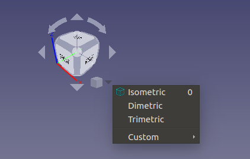

# CubeMenu
CubeMenu provides ability for managing FreeCAD navigation cube menu structure and overall appearance.

### Installation
CubeMenu is a FreeCAD module and can be installed with the FreeCAD [Addon Manager](https://github.com/FreeCAD/FreeCAD-addons#1-builtin-addon-manager). 

#### Manual installation:

Install path for FreeCAD modules depends on the operating system used.

##### Examples:
Linux:

`/home/user/.FreeCAD/Mod/CubeMenu/InitGui.py`

macOS:

`/Users/user_name/Library/Preferences/FreeCAD/Mod/CubeMenu/InitGui.py`

Windows:

`C:\Users\user_name\AppData\Roaming\FreeCAD\Mod\CubeMenu\InitGui.py`

### Discussion
FreeCAD forum thread: https://forum.freecadweb.org/viewtopic.php?f=34&t=43338

